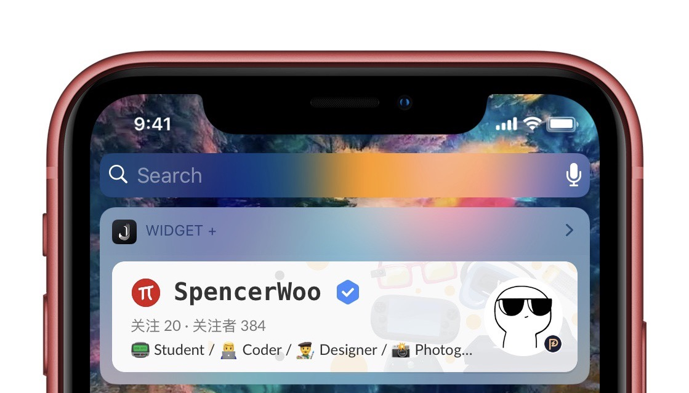

<div align="center">

</div>

# 少数派名片 for JSBox

> 少数派作者名片 | 一个 JSBox 小组件

## Screenshots

### Interface 界面

|     小组件折叠时      |     小组件展开时      |
| :-------------------: | :-------------------: |
|  |  |

按照新版少数派 API，显示了少数派作者：

- 用户名、头像
- 关注与关注者
- 获得勋章
- 用户简介
- 以及获得成就

### Animations 动画

<div align="center">

</div>

## 安装

顾名思义，你需要先在 iOS 上购买 JSBox。

然后，用 Safari 浏览器打开：[Namecard for sspai 的安装链接](https://xteko.com/redir?url=https://github.com/spencerwooo/jsbox-sspai-namecard/blob/master/.output/Namecard%20for%20sspai.box) 来安装脚本。

## 使用

查看脚本源码，找到目录下的 `main.js`，将第八行：

```javascript
var userId = '800610'
```

后面的数字替换为你的少数派用户 ID，通常在你的少数派个人主页的链接里面就可以找到，比如 `https://beta.sspai.com/user/800610/updates` 里面的 `800610` 就是我的少数派用户 ID。

推荐将脚本设置为通知中心小组件，以 Today Widget（小组件）的形式使用。

推荐将 Today Widget（小组件）的高度设置为 240。

## 免责

**少数派作者名片 for JSBox** 和少数派官方无关，只作为 JSBox 中的展示作者信息的途径。

---

💡 **Namecard for sspai** ©Spencer Woo. Released under the MIT License.

Authored and maintained by Spencer Woo.

[@Blog](https://spencerwoo.com/) · [ⒿJike](https://web.okjike.com/user/4DDA0425-FB41-4188-89E4-952CA15E3C5E/post) · [@GitHub](https://github.com/spencerwooo)